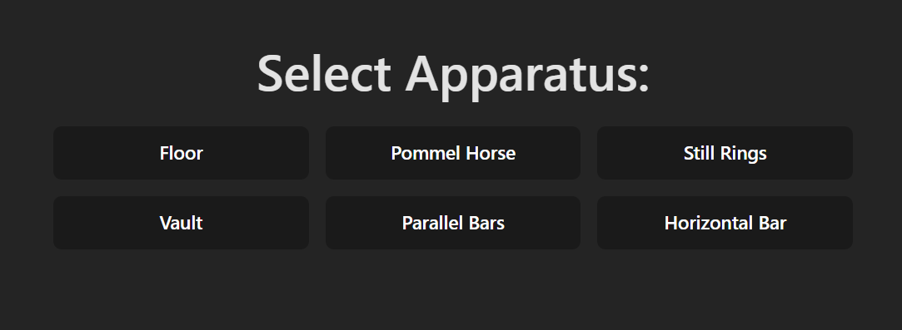
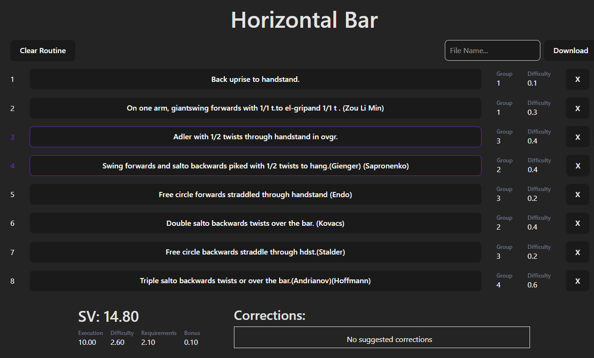
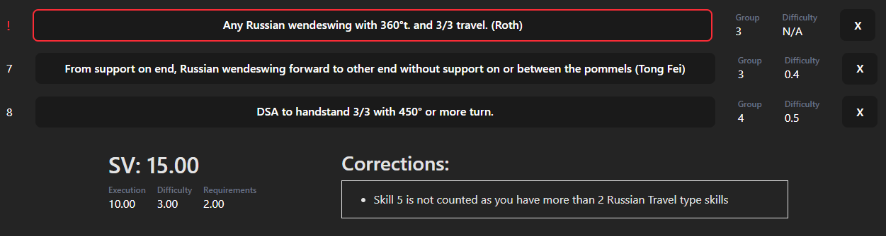
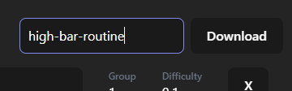

# 🤸 Gymnastics Routine Builder

Build, customize, and optimize your **Men’s Artistic Gymnastics (MAG)** routines with automatic difficulty scoring — no need to dive into the *Code of Points* yourself!  

👉 **Live Demo:** [gymnastics-routine-builder.vercel.app](https://gymnastics-routine-builder.vercel.app)

---

## ✨ Features
🏋️ **Choose apparatus** → Floor, Pommel Horse, Rings, Vault, Parallel Bars, High Bar

📝 **Create a routine** with simple drag-and-drop

🔍 **Check score & suggested improvements** to optimize your routine

📄 **Export to PDF** for easy printing or sharing with your coach

---

## 🚀 Roadmap / Incoming Features
- ✅ Core routine builder & difficulty calculator
- 👥 **User accounts** → save multiple routines under your profile
- 🎨 **Visual skill icons/illustrations** instead of just text
- 🌍 **WAG (Women’s Artistic Gymnastics)** support (future)

---

## 📦 Tech Stack
- **Frontend:** React + TailwindCSS
- **Deployment:** Vercel
- **Planned backend:** Node/Express (for accounts & saved routines)

---

## 📌 Version

v1.0.0 – basic builder with live difficulty scoring & PDF export.

---